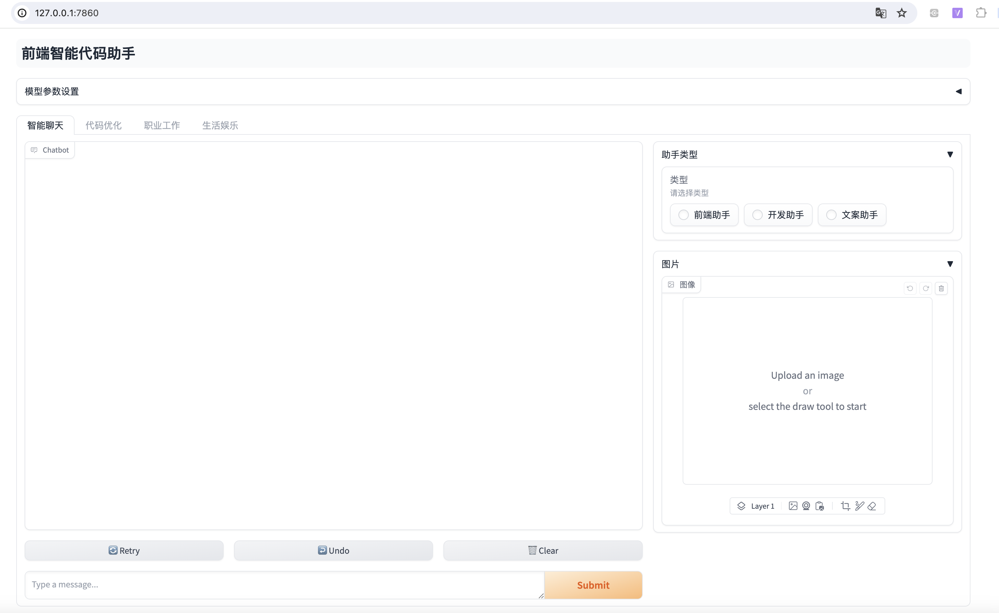

## Starship 前端助手

### 环境要求

1. Python >= 3.11
2. OpenRouter 需要翻墙，DeepSeek 和 Tongyi 不需要
3. 对应平台的 `API_KEY`

### 安装

使用 pip：

    pip install -r requirements.txt

或者使用 [Rye](https://rye.astral.sh/)：

    rye sync
    source .venv/bin/activate

将环境变量 `.env` 复制一份改为 `.env.local`，并根据实际情况修改。
`.env.local` 中的环境变量会优先覆盖 `.env` 中的环境变量。

支持的模型：

### 屏幕截图

### TODO

- [ ] 增加模型选择
- [ ] 多模态，解析图片和文档
- [ ] 增加更多预定义 agent
